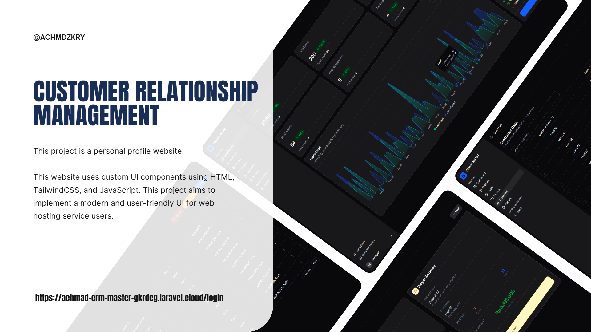

# 🌐 CRM System Sederhana

CRM (Customer Relationship Management) dari PT dibidang ISP (Internet Service Provider), dirancang untuk **digitalisasi pencatatan lead, customer, produk layanan, dan transaksi penjualan**.
Aplikasi ini ditujukan untuk tim **Sales** dan **Manager** agar pengelolaan data lebih efisien, aman, dan terstruktur.

---

## 📌 Fitur / Komponen UI

- 🔑 **Login & Autentikasi**  
  - Hanya user yang login dapat mengakses dashboard.  
  - Autentikasi menggunakan **session** .  

- 📂 **Halaman Leads (Calon Customer)**  
  - Tambah, edit, hapus, dan menampilkan daftar leads.  
  - Informasi: **nama, kontak, alamat, kebutuhan, status**.  
  - Status leads: `new`, `contacted`, `negotiation`, `deal`, `cancel`.  

- 📦 **Halaman Master Produk**  
  - CRUD produk (misal: Paket Internet 50Mbps, 100Mbps, dll).  
  - Setiap produk memiliki **HPP**, **Margin Sales**, dan **Harga Jual** (otomatis dihitung).  

- 📊 **Halaman Project / Deal Pipeline**  
  - Mengubah lead menjadi customer.  
  - Mendukung lebih dari satu produk per transaksi.  
  - Harga per produk bisa dinegosiasikan.  
  - Jika harga di bawah harga jual → **perlu approval leader**.  
  - Status project: `waiting approval`, `approved`, `rejected`.  

- 👥 **Halaman Customer Aktif**  
  - Menampilkan daftar customer yang sudah berlangganan atau active.  
  - Setiap customer dapat memiliki lebih dari satu layanan.  

- 📈 **Halaman Reporting**  
  - Laporan data status leads dan best selling product.  
  - Bisa difilter berdasarkan periode waktu tertentu.  
  - Export laporan ke **Excel**.  

- 🔐 **Role & Akses**  
  - **Sales:** hanya melihat data milik sendiri.  
  - **Manager:** dapat melihat seluruh data semua Sales.  

---

## ⚙️ Instalasi & Development

1. **Clone repository**:

```bash
git clone https://github.com/Aryaaazrr/achmad-crm.git
cd achmad-crm
```

2. **Install dependency Laravel & Node.js**:

```bash
composer install
npm install
```

3. **Konfigurasi `.env`**:
- Sesuaikan database, URL aplikasi, dan konfigurasi lainnya.

```bash
cp .env.example .env
```

4. **Generate App Key**:

```bash
php artisan key:generate
```

5. **Jalankan migrasi dan seeder**:

```bash
php artisan migrate --seed
```

6. **Compile frontend (React + Tailwind) dan jalankan aplikasi**:

```bash
composer run dev
```

7. **Akses aplikasi**: Buka `http://localhost:8000` di browser.

---

## 🔗 Link Demo 

 `https://achmad-crm-master-gkrdeg.laravel.cloud/login`

## 🚀 Cara Penggunaan

1. Login sebagai **Sales** atau **Manager**.
   - Akun demo Sales
     - email : sales@example.com
     - password : p4ssword
   - Akun demo Manager
     - email : manager@example.com
     - password : p4ssword
2. Tiap role memiliki permission tertentu untuk melakukan aksi perubahan data (selengkapnya dapat dilihat di file RoleAndPermissionSeeder.php).
3. Navigasi melalui sidebar ke modul CRM: Dashboard, Leads, Project, Customer, Products.
4. Gunakan fitur **Reporting** untuk melihat laporan dan export Excel.
5. Klik avatar di sidebar navigasi bottom untuk membuka menu **Settings** & **Logout**.

---

## 🛠️ Teknologi

- **Backend:** Laravel 12
- **Frontend:** ReactJS + Inertia.js + TailwindCSS + ShadcnUI
- **Database:** PostgreSQL 
- **Tools:** Node.js, npm / bun

---

## 📄 Lisensi

Proyek ini bersifat **open-source**.
Silakan digunakan, dimodifikasi, dan dikembangkan sesuai kebutuhan.

---

✦ Dibuat dengan 💻 dan ☕ oleh [Aryaaazrr](https://github.com/Aryaaazrr)
